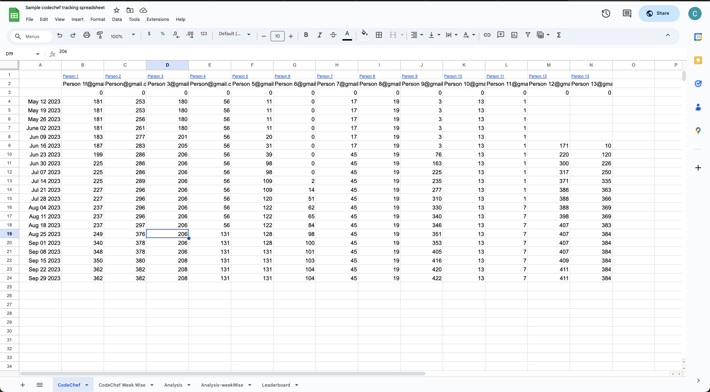
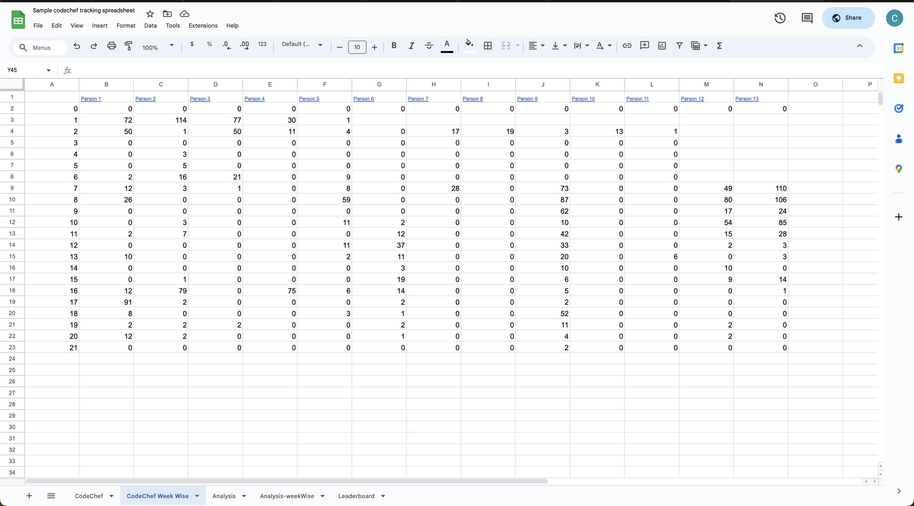
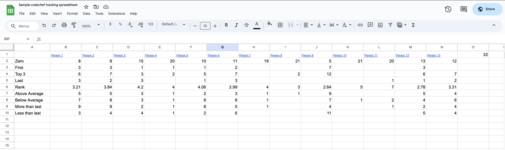
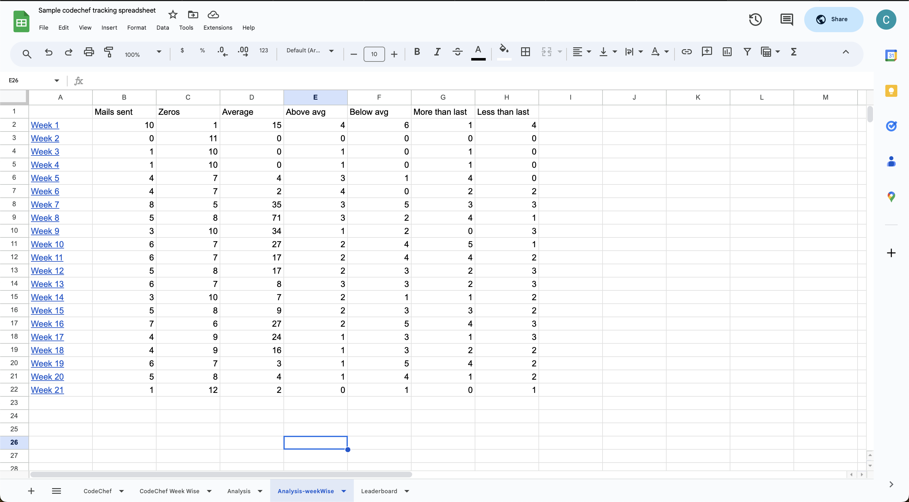
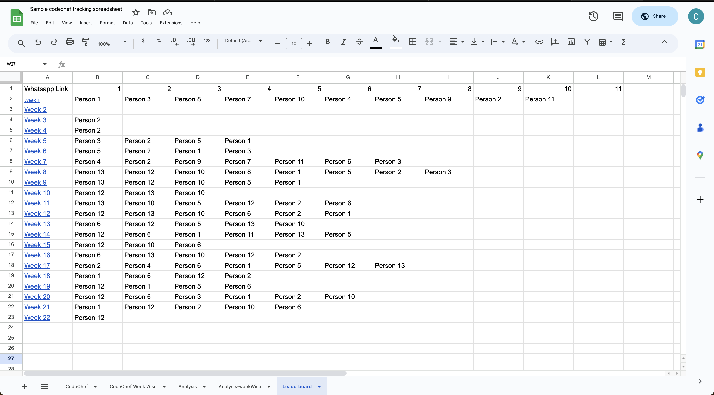

# CodeChef Profile Tracker 🚀

## Table of Contents
- [Overview](#overview)
- [Features](#features)
- [Advantages](#advantages)
- [Technology Stack](#technology-stack)
- [Showcase](#showcase)
- [Getting Started](#getting-started)
  - [Setting Up Google Apps Script](#setting-up-google-apps-script)
    - [What is Google Apps Script](#what-is-google-apps-script)
    - [Use Cases of Google Apps Script](#use-cases-of-google-apps-script)
    - [Steps to Set Up Google Apps Script](#steps-to-set-up-google-apps-script)
  
## Overview 
Welcome to the CodeChef Profile Tracker! This project is designed to enhance your experience with CodeChef challenges by bringing a competitive edge and community-driven motivation. 

The CodeChef Profile Tracker automates the process of tracking and analyzing your progress on CodeChef, making it easy to see how you and your friends are performing over time. By utilizing this tool, you can foster a healthy, competitive environment where everyone is encouraged to improve their coding skills through regular participation in challenges.

## Features 

### 1. Automated Scraping
###### Effortlessly fetches CodeChef profile data, eliminating the need for manual input and ensuring accurate and up-to-date information.

### 2. Dynamic Leaderboard
###### Generates a weekly leaderboard to encourage healthy competition, showcasing top performers, improvements, and notable achievements.

### 3. Performance Analysis
###### Delivers detailed insights into individual and group progress, including leaderboard standings, performance trends, and comparative statistics.

### 4. WhatsApp Integration
###### Simplifies communication by providing shareable links through the WhatsApp API, enabling easy sharing of analyses within your CodeChef community.

### 5. Automated Emails
###### Motivational reports are sent directly to participants, acknowledging achievements and encouraging consistent engagement.

## Advantages 

- **Motivation Boost:** Fosters friendly competition, driving increased participation and motivation within your CodeChef community.
- **Skill Enhancement:** Promotes consistent problem-solving, leading to skill development and improvement over time.
- **Efficiency:** Automated processes streamline data tracking, analysis, and communication, ensuring a seamless user experience.

## Technology Stack 

- **Google Apps Script:** Leverages the power of Google Apps Script for seamless integration with Google services, providing a robust foundation for automation.
- **Google Spreadsheet:** Centralizes data storage on Google Spreadsheet, facilitating easy access, organization, and reference for users.
- **Gmail API:** Automates email communication through Gmail API, ensuring timely delivery of personalized performance reports.
- **Real-time Web Scraping:** Utilizes real-time web scraping techniques to fetch the latest CodeChef profile data, keeping information up-to-date.

## Showcase 

Explore the project in action through our carefully curated showcase, featuring images and a demo video. Witness firsthand the impact of the CodeChef Profile Tracker in boosting problem-solving skills within the community.

### Demonstration Video
[View Project Demonstration video](codechef.mp4)

### Stored data of total number of questions solved of every candidate in a sheet

### Store total number of questions solved on CodeChef per week

### Analyzed data of every candidate of various weeks

### Analyzed data per week

### Leaderboard with candidate names of every week

## Getting Started 

1. **Spreadsheet Setup:**
- Use the provided spreadsheet format as a template for your data [Template Spreadsheet](https://docs.google.com/spreadsheets/d/1DrZb8kZnnuUaxhDk4-R5SFUAyrjcJh35PiF7let53Yg/edit?usp=sharing).
- Replace Spreadsheet ID with your spreadsheet ID in the Apps Script code. Also, change the phone number in a variable in the code (for WhatsApp API).
- Use this Apps Script file code on Google Apps Script IDE only.

### Setting Up Google Apps Script

#### What is Google Apps Script

Google Apps Script is a scripting platform developed by Google for light-weight application development in the G Suite platform. It allows users to create and publish web applications and automate tasks across Google products and third-party services.

#### Use Cases of Google Apps Script

- Automate repetitive tasks
- Extend Google Workspace apps like Sheets, Docs, and Forms
- Build web applications and add-ons
- Integrate with external APIs

#### Steps to Set Up Google Apps Script

1. **Create a New Project:**
   - Go to [Google Apps Script](https://script.google.com/).
   - Click on "New project".

2. **Rename the Project:**
   - Click on "Untitled project" and give your project a meaningful name.

3. **Add Your Code:**
   - Replace the default code in the script editor with your Apps Script code.

4. **Link to Your Google Sheet:**
   - Replace the Spreadsheet ID in your script with your own Google Sheet ID.

5. **Set Up Triggers:**
   - Go to the "Triggers" section in the Apps Script project.
   - Click on "Add Trigger" and set up your desired triggers (e.g., time-driven, form submission).

6. **Authorize Your Script:**
   - Run your script for the first time and authorize the necessary permissions.

7. **Deploy Your Script:**
   - Click on "Deploy" and choose "Test deployments" to ensure everything is working as expected.
   - Once tested, choose "Deploy" -> "New deployment" and configure your deployment settings.

By following these steps, you can set up and start using Google Apps Script for your CodeChef Profile Tracker project.

## License

This project is licensed under the MIT License - see the [LICENSE](LICENSE) file for details.
